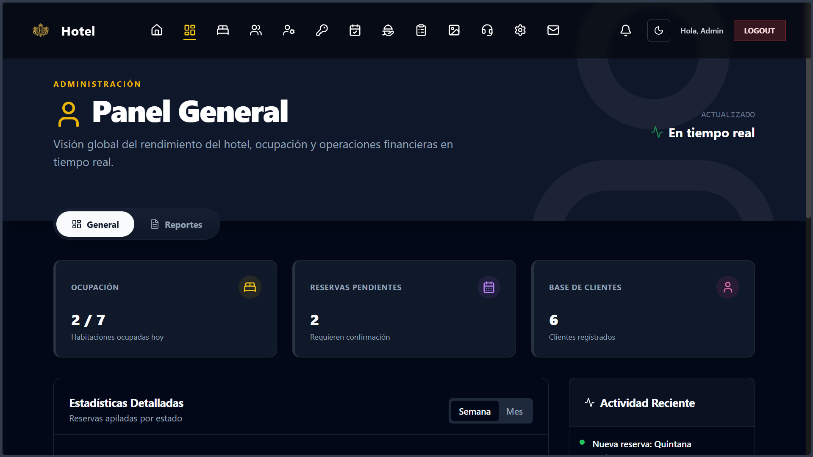
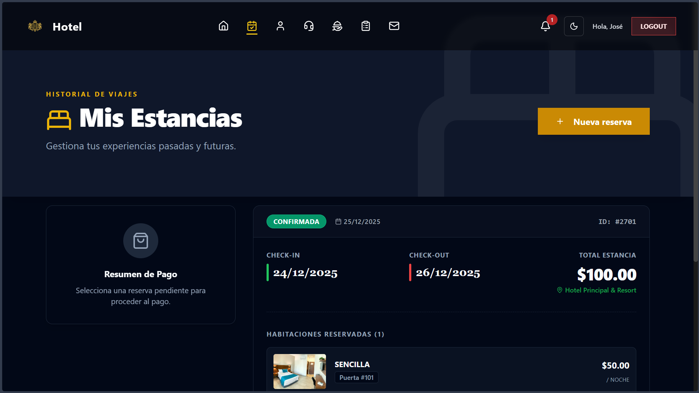

# Sistema de Gestión Hotelera - HotelApp

## 1. Descripción General y Objetivo

Este proyecto es una aplicación web integral para la gestión de un hotel, desarrollada como parte del desafío técnico asignado. El sistema es robusto, seguro y escalable, utilizando **JHipster** para la infraestructura de backend y **React** para la interfaz de usuario.

El núcleo de la solución es una arquitectura basada en roles (RBAC) gestionada por **Keycloak**, donde la experiencia de usuario se adapta dinámicamente según si el usuario es un Administrador, un Empleado o un Cliente.

## 2. Stack Tecnológico

El proyecto cumple estrictamente con el stack tecnológico solicitado:

*   **Core/Backend**: Java + Spring Boot (Generado vía JHipster).
*   **Frontend**: React + Vite + Tailwind CSS.
*   **Seguridad**: Keycloak (OAuth2 / OIDC) para Gestión de Identidad y Acceso (IAM).
*   **Base de Datos**: PostgreSQL.
*   **Control de Versiones**: Git.
*   **Modelado**: JDL (JHipster Domain Language) - Archivo `hotel-entity.jdl` incluido en la raíz del backend.

## 3. Arquitectura y Diseño del Dominio

El modelo de dominio ha sido diseñado utilizando JDL para garantizar consistencia y generar el código base automáticamente.

### Entidades Principales
*   **Reserva**: Núcleo del negocio, vincula clientes con habitaciones.
*   **Habitacion**: Gestiona inventario, categorías y estados (Disponible, Ocupada, Mantenimiento).
*   **Cliente**: Información de huéspedes, vinculada a Keycloak para autenticación.
*   **Servicio**: Servicios adicionales (Spa, Tours, etc.) que pueden ser contratados y pagados.
*   **Factura/Pago**: Gestión financiera de las reservas.

### Roles y Seguridad (RBAC)
La seguridad está delegada a Keycloak. Se han configurado los siguientes roles:

| Rol | Descripción | Acceso |
| :--- | :--- | :--- |
| **ROLE_ADMIN** | Administración Total | Configuración, gestión de usuarios, reportes globales, CRUD completo. |
| **ROLE_EMPLOYEE** | Operación Diaria | Front-desk: Check-in/Check-out, reservas, atención al cliente. |
| **ROLE_CLIENT** | Autogestión | Portal del cliente: Mis reservas, reservar nueva habitación, historial. |

## 4. Guía de Ejecución (Paso a Paso)

### Prerrequisitos
*   Java 17+
*   Node.js 18+
*   Docker Desktop (corriendo)

### Paso 1: Levantar Servicios de Infraestructura (Base de Datos + Keycloak)
Desde la carpeta `backend`, ejecuta el siguiente comando para levantar PostgreSQL y Keycloak configurados automáticamente:

```bash
docker compose -f src/main/docker/services.yml up -d
```

> **Nota**: Keycloak importará automáticamente el realm `jhipster` con los usuarios y roles preconfigurados desde `src/main/docker/realm-config`.
> Espera unos minutos hasta que Keycloak esté completamente operativo (puedes verificar los logs en Docker).

### Paso 2: Ejecutar el Backend (Spring Boot)
En una nueva terminal, dentro de la carpeta `backend`:

```bash
./mvnw
```
(O `./mvnw spring-boot:run` si prefieres).
El backend iniciará en `http://localhost:8081`.

### Paso 3: Ejecutar el Frontend (React)
En una nueva terminal, entra a la carpeta `UI`:

```bash
cd ../UI
npm install
npm run dev
```
El frontend iniciará en `http://localhost:5173` (o el puerto que indique Vite).

## 5. Credenciales de Prueba

El sistema viene precargado con usuarios para probar cada uno de los roles exigidos.
**Realm**: `jhipster` (Importado automáticamente).

| Rol | Usuario | Contraseña | Comentarios |
| :--- | :--- | :--- | :--- |
| **ADMIN** | `admin` | `admin` | Acceso total al Back-office. |
| **EMPLOYEE** | `employee` | `user` | Acceso a funciones de empleado (Front-desk). |
| **CLIENT** | `client` | `user` | Acceso al Portal del Cliente. |

Tambien existen usuarios clientes adicionales de prueba como `juan.perez` (password: `user`).

## 6. Configuración de Keycloak
La configuración se realiza automáticamente vía Docker. El archivo de exportación del realm se encuentra en:
`backend/src/main/docker/realm-config/jhipster-realm.json`

Si necesitas acceder a la consola de administración de Keycloak:
*   URL: `http://localhost:9080/`
*   Usuario Admin de Keycloak: `admin`
*   Password Admin de Keycloak: `admin`

## 7. Capturas de Pantalla

### Vista Principal (Landing Page)


### Panel de Administración (Back-office)



### Vista del Empleado (Gestión de Reservas)


### Portal del Cliente (Mis Reservas)

---
**Entregables incluidos**:
*   [x] Código Fuente
*   [x] Archivo JDL (`backend/hotel-entity.jdl`)
*   [x] Configuración Keycloak (`jhipster-realm.json`)
*   [x] Documentación README
